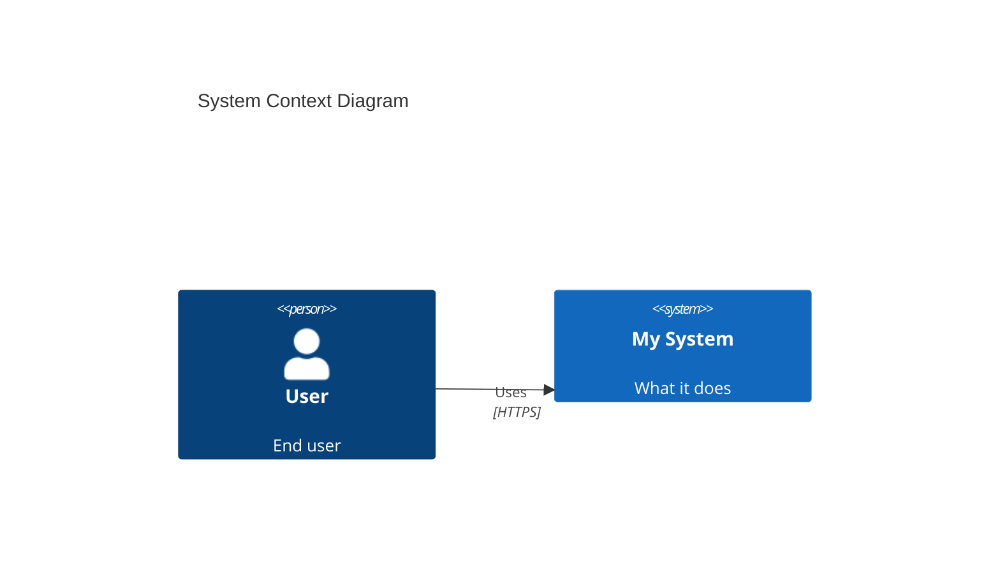

# C4 Architecture Model

Maintain a machine-checkable C4 architecture model alongside the narrative ARCHITECTURE.md. The model is the single source of truth for boundaries, dependencies, and diagrams.

## When This Applies

Check the project setting before using this skill:

```bash
pvg settings architecture.c4
```

- `true` -- maintain the model, enforce boundaries, generate diagrams
- `false` (default) -- skip entirely, use narrative ARCHITECTURE.md only

If the setting is not enabled and the user hasn't asked for C4, do not use this skill.

## File Layout

```
workspace.dsl              # Canonical C4 model (Structurizr DSL)
docs/diagrams/             # Generated diagram artifacts (SVG/PNG/Mermaid)
ARCHITECTURE.md            # Narrative architecture (always exists, references model)
```

The `workspace.dsl` file is version-controlled alongside code. It is the machine-checkable twin of ARCHITECTURE.md.

## Structurizr DSL Quick Reference

### Minimal Example

```
workspace "Project Name" "Brief description" {

    model {
        user = person "User" "End user of the system"

        system = softwareSystem "My System" "What it does" {
            web = container "Web App" "User-facing UI" "React"
            api = container "API" "Business logic" "Go"
            db  = container "Database" "Persistent storage" "PostgreSQL" "Database"
        }

        # Relationships
        user -> web "Uses" "HTTPS"
        web -> api "Calls" "REST/JSON"
        api -> db "Reads/writes" "SQL"
    }

    views {
        systemContext system "Context" "System context diagram" {
            include *
            autoLayout
        }

        container system "Containers" "Container diagram" {
            include *
            autoLayout
        }

        styles {
            element "Person" {
                shape Person
                background #08427B
                color #ffffff
            }
            element "Software System" {
                background #1168BD
                color #ffffff
            }
            element "Container" {
                background #438DD5
                color #ffffff
            }
            element "Database" {
                shape Cylinder
            }
        }
    }
}
```

### Core Elements

```
person <name> [description] [tags]
softwareSystem <name> [description] [tags] {
    container <name> [description] [technology] [tags] {
        component <name> [description] [technology] [tags]
    }
}
```

### Relationships

```
source -> destination "Description" "Technology" "tags"
```

Inside an element block, use `this`:
```
container "API" {
    this -> db "Reads from" "SQL"
}
```

### Tags and Properties

```
api = container "API" "Business logic" "Go" "Critical"

container "API" {
    tags "Critical" "Backend"
    properties {
        owner "team-billing"
        code  "services/api/**"
    }
}
```

### Views

```
systemContext <system-id> [key] [description] { include *; autoLayout [tb|bt|lr|rl] }
container <system-id> [key] [description] { include *; autoLayout }
component <container-id> [key] [description] { include *; autoLayout }
deployment <system-id|*> <environment> [key] [description] { include *; autoLayout }
```

### Styles

```
styles {
    element "Tag" {
        shape <Box|RoundedBox|Circle|Cylinder|Person|Hexagon|Folder|Pipe|...>
        background #rrggbb
        color #rrggbb
        border <solid|dashed|dotted>
    }
    relationship "Tag" {
        color #rrggbb
        style <solid|dashed|dotted>
        thickness <integer>
    }
}
```

## Architecture Contract

When C4 is enabled, the Architect MUST include a machine-checkable Architecture Contract section in ARCHITECTURE.md:

````markdown
## Architecture Contract

```yaml
contract_version: 1
boundaries:
  - id: billing.service
    kind: container
    code:
      - services/billing/**
    exposes:
      - services/billing/api/**

  - id: shared.domain
    kind: component
    code:
      - libs/domain/**

dependency_rules:
  allow:
    - billing.service -> shared.domain
  deny:
    - billing.service -> *.database_direct
  notes:
    - "All DB access goes through shared.persistence"
```
````

Rules:
- Every boundary has a unique `id` matching an element in `workspace.dsl`
- `code` maps boundaries to file paths (globs)
- `exposes` declares public interfaces
- `dependency_rules` are machine-checkable: `allow` is the whitelist, `deny` is the blacklist

## Agent Responsibilities

### Architect Agent
1. Create and maintain `workspace.dsl` alongside ARCHITECTURE.md
2. Include the Architecture Contract section in ARCHITECTURE.md
3. Keep `workspace.dsl` elements consistent with the contract boundaries

### Sr PM Agent
Add to every story that touches code (when C4 is enabled):
- **AC: Architecture boundaries respected**
- **AC: Diagrams regenerated** (if architecture changed)

### Sr PM Agent

When C4 is enabled, add to every story that touches code:
- **AC: Architecture boundaries respected** (no new cross-boundary dependencies unless contract updated)
- **AC: Diagrams regenerated** (if architecture changed)

Add to the story's MANDATORY SKILLS TO REVIEW section:
- `c4` -- for boundary checking

### Developer Agent
Before coding:
1. Read the Architecture Contract
2. Identify which boundaries the story's code paths fall within
3. Note allowed and denied dependencies for those boundaries

After coding:
1. Verify no new imports cross boundaries outside the `allow` rules
2. If architecture changed: update `workspace.dsl` and the Architecture Contract
3. If `workspace.dsl` changed: regenerate diagrams

### Anchor Agent
Review checklist addition:
- Every boundary in `workspace.dsl` has a matching contract entry
- No stories introduce cross-boundary dependencies without contract updates

## Diagram Export

### Using Structurizr CLI (if available)
```bash
structurizr-cli export -workspace workspace.dsl -format mermaid -output docs/diagrams/
```

### Manual Mermaid Generation (no dependencies)


## What This Skill Does NOT Do

- Does not require Structurizr CLI as a dependency (Mermaid generation works without it)
- Does not add CI checks (the Anchor agent performs this role)
- Does not change any behavior when architecture.c4 is false

## Invocation

```bash
codex "Use skill c4. Create a workspace.dsl for the current project."
codex "Use skill c4. Check architecture boundaries for this PR."
```
